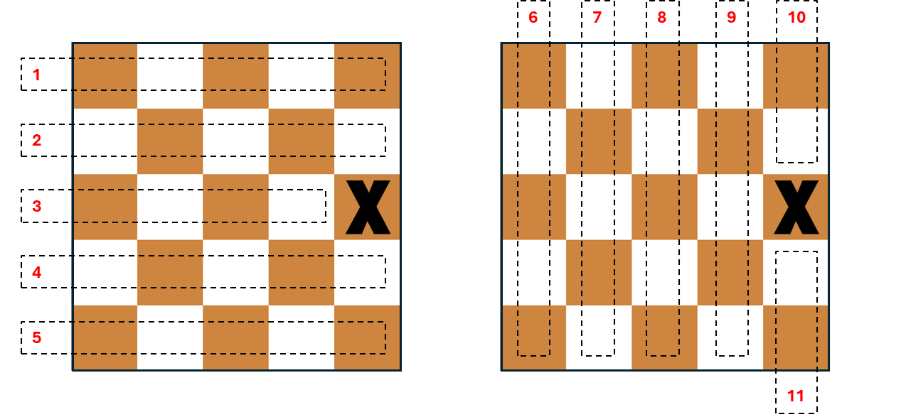

# Harmless Rooks

__Puzzle:__ [Harmless Rooks](https://www.codingame.com/training/hard/harmless-rooks)

__Author:__ [@Niako](https://www.codingame.com/profile/eb89cbdf69d07106c84edf1d191caaf33289651)

__Published Difficulty:__ Hard

__Algorithm X Complexity:__ Algorithm X is the Easy Part

# Problem Statement

Harmless Rooks is a hard puzzle, but a very short Algorithm X setup can easily solve the first two test cases and get you moving in a powerful direction. Although the Algorithm X setup is not terribly complex, some background is helpful. For convenience, I have copied the entire goal statement here:

> The __rook__ is a chess piece that can move along its current line (horizontally) or column (vertically) through any number of free (unoccupied) squares.
>
>In this problem, we consider an N × N generalized chess board where the squares are either free (. in the input) or already occupied (X in the input) and hence cannot be crossed by the rooks.
>
>Compute the __maximum number of rooks__ that can be placed on __free squares__ in such a way that __no two rooks threaten each other__ (hence two rooks on the same line/column must be separated by at least one occupied square).

# A Perfect World

Rooks move along horizontal and vertical lines. On a standard 8 x 8 chessboard, there are 8 rows and 8 columns. A rook placed on location `(r, c)` _threatens_ all locations in row  `r` and all locations in column `c`. Because there is no functional difference between a row and a column, I will refer to all rows and all columns as `AttackLine`s, an uninterrupted group of 1 or more cells that, together, make a horizontal or vertical line. A rook placed on any location in the `AttackLine` threatens all other locations in the `AttackLine`.

Placing a single rook on a standard 8 x 8 chessboard covers two `AttackLine`s, one horizontal and one vertical. On any `N x N` chessboard, consisting of all free squares, a maximum of `N` rooks can be placed. Each rook occupies one row and one column. Using this unobstructed chessboard, the following problem could be considered:

>Given an `N x N` chessboard with all free squares, how many different ways can `N` rooks be placed on the board, such that no rook threatens any other rook?

How could Algorithm X be set up to solve this problem? What are the requirements? Every one of the `N * N` `AttackLine`s must be covered by a rook. What are the actions? Each action is simply placing a rook at location `(r, c)` and each action coves two requirements, one for each `AttackLine` coved by the rook placement.

Asking Algorithm X to find the number of possible configurations for values of `N` between 2 and 10 results in the following:

| N | Valid Configurations |
|:-----:|:---------:|
|2|2|
|3|6|
|4|24|
|5|120|
|6|720|
|7|5040|
|8|40320|
|9|362880|
|10|3628800|

It is not difficult to show that for any `N x N` chessboard, there are `N` factorial ways to arrange the rooks. However, I chose to illustrate how Algorithm X could produce these results to lay the groundwork for an Algorithm X approach to the oddly configured boards found in Harmless Rooks.

# Handling Occupied Spaces

Harmless Rooks has some large boards with many spaces already occupied. Since rooks cannot cross occupied squares, each occupied square either shortens an `AttackLine` or divides an `AttackLine` into two separate lines. Even a single location, bordered on all sides by occupied spaces, forms two `AttackLine`s, one horizontal and one vertical. Placing a rook on that isolated space occupies both `AttackLine`s.

On a board with no occupied spaces, the maximum number of rooks is always `N`. Each rook placed covers one column and one row. Said another way, each rook covers exactly two `AttackLine`s and __all__ `AttackLine`s are covered. As soon as occupied spaces show up on a board, it can get much more difficult to cover every `AttackLine`. The following diagrams shows all `AttackLine`s on a 5 x 5 board with a single edge square occupied.

 

 

The board now has 11 `AttackLine`s. Each rook placed covers exactly 2 `AttackLine`s, making it is impossible to cover every `AttackLine`. However, we might consider asking Algorithm X to attempt the following:

>Try to cover every `AttackLine` by placing rooks on open squares. If no solution exists that covers all `AttackLine`s, return the length of the partial solution that gets the closest.

